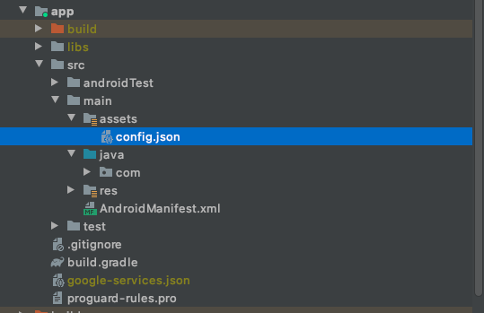
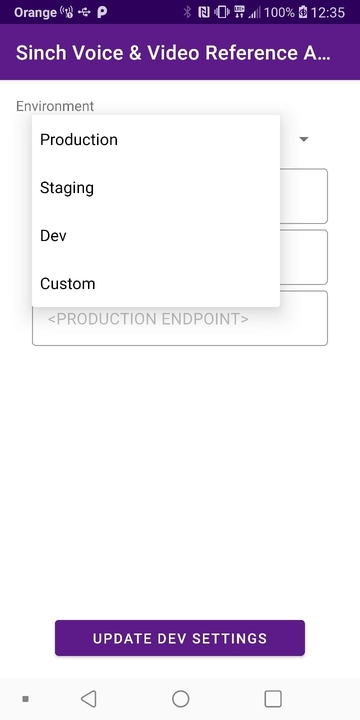

# In-app Voice and Video Reference Application for Android

Reference Applications for the Android Client.

# Set up

#### 1. Create configuration file

To communicate with Sinch API you must include your application specific authorization settings (key and secret). In order to do this, check config.json file located in app/src/main/assets folder and fill it with these values copied from Sinch Dashboard website of your application:

.

Basic structure of the file looks as follows:

```json
{
  "name": "production",
  "appKey": "<PRODUCTION APP KEY>",
  "appSecret": "<PRODUCTION APP SECRET>",
  "environment": "<PRODUCTION ENDPOINT>",
  "cli": "<CALLER IDENTIFIER>"
}
```

Parameters description:

- name - Name of the environment as displayed in the settings screen.
- appKey - Application key copied from your Sinch Dashboard webpage of the application.
- appSecret - Application secret copied from your Sinch Dashboard webpage of the application.
- environment - Base URL used to make REST calls against Sinch API (E.g. ocra.api.sinch.com).
- cli - Caller identifier used while making PSTN calls. This property is optional however it won't be possible to make App-To-Phone calls if not defined (the option won't be listed).

It possible to include as many environments as you wish (you will be able to switch between them from the settings screen of the sample):


To do this simply place a list of the environment objects in the 'config.json' file:

```json
[
  {
    "name": "Production",
    "appKey": "<PRODUCTION APP KEY>",
    "appSecret": "<PRODUCTION APP SECRET>",
    "environment": "<PRODUCTION ENDPOINT>",
    "cli": "<CLI USED IN PRODUCTION ENV>"
  },
  {
    "name": "Staging",
    "appKey": "<STAGING APP KEY>",
    "appSecret": "<STAGING APP SECRET>",
    "environment": "<STAGING ENDPOINT>"
  },
  {
    "name": "Dev",
    "appKey": "<DEV APP KEY>",
    "appSecret": "<DEV APP SECRET>",
    "environment": "<DEV ENDPOINT>"
  }
]
```

#### 2. Add your google-services.json file

This sample uses Firebase Cloud Messaging for delivering push notifications.  
In order for push notification to work you must generate and include your application specific (with correspondent "package_name") google-services.json file.  
Instructions regarding creating the file are located at Firebase Manual website [here](https://firebase.google.com/docs/android/setup).  
For more information regarding Sinch Managed Push Notifications refer to Sinch Voice-Video calling documentation [here](https://developers.sinch.com/docs/voice-android-cloud-push-notifications#2-provision-the-application-with-the-support-code).
